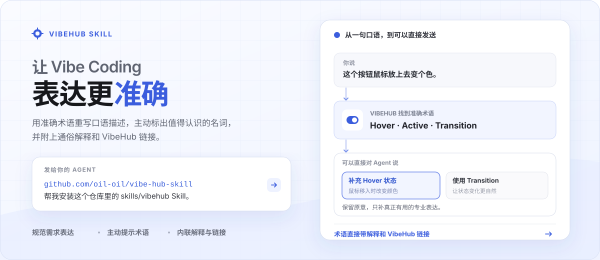

<p align="center">
  
</p>

VibeHub Skill 是一个面向普通人的 Vibe Coding 学习助手。你不需要先知道专业名称，Agent 会帮你找到下一步、学懂一个概念，并把它用回真实项目。

## 一分钟安装

把下面这段话完整发给你的 Agent：

```text
https://github.com/oil-oil/vibe-hub-skill

帮我安装这个仓库里的 skills/vibehub Skill。
```

第一次使用时，即使你还不知道该学什么，Agent 也会主动给出几个具体方向。你也可以直接从一句不专业的话开始：

```text
我想让这个设置改完马上生效，但不知道该用什么控件。带我弄懂。
```

## 它具体能做什么

1. **帮你找到术语**：说出想实现的效果，Agent 帮你找到它的名称并用人话解释。
2. **带你学习主题**：明确选择一个主题后，Agent 安排解释、示例、课程和练习。
3. **结合项目学习**：只讲当前项目真正需要的知识，并帮助你应用和验证。
4. **主动推荐下一步**：不知道学什么时，根据项目或常见目标给出几个具体起点。

本地互动是一种教学方式，不是固定课程。设计和维护 VibeHub 教程属于隐藏的维护者能力，不会干扰普通用户的首次使用。

## 不知道学什么也可以开始

没有明确需求时，Agent 不会只问“你想学什么”，也不会直接打开课程。它会根据当前项目主动推荐几个方向，例如：

- 做出第一个网站
- 让页面更清楚、更有层级
- 做好表单与交互反馈
- 看懂 API 与前后端
- 用 Git 保存与协作
- 把网站部署上线

选择一个方向后，Agent 会先给出短路线；等你明确当前要学的主题，再打开需要的课程或互动。

## 可以这样问

| 当你想知道 | 可以直接对 Agent 说 |
| --- | --- |
| 一个东西叫什么 | `点一下就展开右侧面板的交互叫什么？` |
| 两个术语有什么区别 | `Switch 和 Checkbox 到底有什么区别？不要只给定义，让我实际比较。` |
| 页面为什么不好看 | `这个页面为什么显得没有主次？结合当前页面带我理解。` |
| 做网站需要学什么 | `我想从零做出第一个网站，需要依次理解哪些术语？` |
| 怎样提升网站质感 | `我想让网站更简约、有呼吸感，应该学习哪些概念？` |
| 怎样把网站上线 | `我想部署自己的网站，先带我弄懂域名、DNS、构建和托管。` |

## 不只是一份术语表

同一个术语，可以根据你的目的变成不同的学习方式：

- **一句话解释**：快速知道它是什么、什么时候用。
- **差异对比**：把容易混淆的概念放在一起观察。
- **学习路径**：把完成一个目标需要的知识按顺序组合起来。
- **边做边学**：结合当前项目，在修改前理解原因。
- **本地互动**：由 Agent 针对当前问题生成选项、预览、反馈与结果。

## 本地互动会因人而异

仓库只提供稳定的互动框架，负责页面外壳、状态、结果记录和本地运行。真正的题目、选项、示例、解释与反馈，由 Agent 根据当前用户和项目生成。

因此，它不是打开一个所有人都相同的演示页，而是可以：

- 用你的设置页讲清楚 Switch 与 Checkbox
- 用你的首页对比视觉层级与留白
- 用你的部署方式解释环境变量和构建产物
- 把几个相关术语组合成一条项目学习路径

互动默认运行在本机。只有当你明确要学习某个主题，而且页面确实有助于理解时，Agent 才会使用内置浏览器打开课程或互动。第一次使用、推荐方向和普通项目修复不会自动打开页面。

## 学习原则

- **不知道学什么时，主动给方向**
- **先体验差异，再补充名称**
- **一次只解决一个理解目标**
- **让用户做判断，不替用户答完**
- **最后回到真实项目验证**

## 数据与隐私

- 知识检索只发送经过程序脱敏的简短问题。
- 常见密钥、网址、邮箱、本地路径和代码块会在发送前移除。
- 本地互动运行在 `127.0.0.1`，生成文件与结果保存在本机。
- Agent 已经看到的项目上下文，仍受所用产品和模型服务商的隐私设置约束。
- 无法访问 VibeHub 时，Skill 会明确说明，不会伪造术语页面和学习路径。

## 开发

需要 Node.js 20 或更高版本。

```bash
npm test
```

需要连接本地 VibeHub 网站时：

```bash
node skills/vibehub/scripts/vibehub.mjs resolve \
  --query "Switch 和 Checkbox 有什么区别" \
  --site-url http://localhost:3100
```

<details>
<summary>仓库结构</summary>

```text
skills/vibehub/
├── SKILL.md                  # Agent 行为与学习流程
├── agents/openai.yaml        # Skill 元数据
├── assets/lab-kit/           # 本地互动框架
├── references/               # 浏览、教程与互动编写规范
├── scripts/                  # 知识解析与本地运行脚本
└── vibehub.config.json
```

</details>

知识与学习路径由 VibeHub 网站维护；这个仓库只维护 Agent 工作流、解析器和本地互动运行时。

欢迎通过 Issue 或 Pull Request 改进术语学习流程、本地互动与 Agent 兼容性。

## 许可

[MIT](LICENSE)
